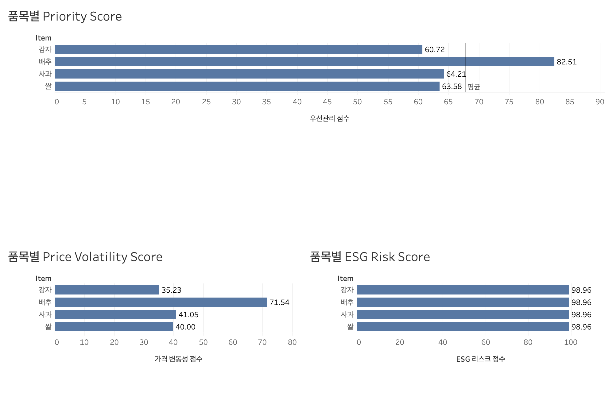

# 🥗 Food ESG & Supply Chain Analysis

<p align="right">
  <a href="#-english-version">🇺🇸 English</a> | 
  <a href="#-한국어-버전">🇰🇷 한국어</a>
</p>

---

## 🇺🇸 English Version

### 1. Project Overview
An integrated analysis project evaluating sustainable food portfolios by considering consumption, price, supply chain, and ESG factors. This project identifies high-priority food categories by analyzing price volatility alongside environmental impact (ESG) risks.

### 2. Project Goals
1. **Identify Volatility:** Which food items exhibit the highest price fluctuations?
2. **Prioritization:** Which categories require urgent management when considering both economic and ESG risks?
3. **Pipeline Construction:** Can we implement an end-to-end analysis pipeline connecting SQL, Python, and Tableau?

### 3. Data Sources
* **KOSIS:** Consumer Price Index (CPI) for food items.
* **KAMIS:** Monthly retail price data for Rice, Apple, Napa Cabbage, and Potato.
* **FAOSTAT:** Agri-food systems emissions data for South Korea to generate ESG risk metrics.

### 4. Tech Stack
* **SQL (DuckDB):** Monthly price change rates and statistical volatility summaries.
* **Python (Pandas, Numpy):** Data preprocessing, normalization, and composite scoring.
* **Tableau:** Priority Score dashboard and visual analysis.

### 5. Analysis Flow
* **Step 1. Data Collection:** Raw data ingestion from KOSIS, KAMIS, and FAOSTAT.
* **Step 2. Data Processing:** Transformed wide-to-long formats (KOSIS) and parsed HTML-based XLS (KAMIS).
* **Step 3. SQL Analytics:** Calculated `LAG` values, price growth rates, and volatility summary stats.
* **Step 4. Scoring:** Generated Price Volatility and ESG Risk Scores to calculate the final **Priority Score**.

### 6. Key Results
| Item | Priority Score | Status |
| :--- | :--- | :--- |
| **Napa Cabbage** | **82.51** | **Rank 1** (Highest volatility & seasonal risk) |
| **Apple** | **64.21** | Rank 2 (Significant price swings) |
| **Rice** | **63.58** | Rank 3 (Stable price but moderate ESG load) |
| **Potato** | **60.72** | Rank 4 (Lowest management priority among categories) |

### 7. What I Learned
* Handling diverse public data formats (xlsx, HTML-based xls, csv).
* Time-series price analysis using **SQL Window Functions**.
* Designing a multi-criteria scoring model for business intelligence.
* Implementing a complete lifecycle from raw data collection to Tableau dashboard.

---

## 🇰🇷 한국어 버전

# food-esg-supplychain-analysis

지속가능한 식품 포트폴리오를 위한 소비·가격·공급망·ESG 통합 분석 프로젝트

## 1. Project Overview
이 프로젝트는 식품 품목별 가격 변동성과 ESG 부담을 함께 고려하여  
우선 관리가 필요한 식품 카테고리를 도출하는 데이터 분석 프로젝트입니다.

단순 가격 비교가 아니라,  
- 월별 가격 변동성
- ESG 리스크
- 통합 우선관리 점수(Priority Score)

를 결합해 의사결정용 대시보드로 시각화했습니다.

---

## 2. Project Goal
다음 질문에 답하는 것을 목표로 했습니다.

1. 어떤 식품 품목의 가격 변동성이 큰가?
2. ESG 리스크를 함께 고려하면 어떤 품목을 우선 관리해야 하는가?
3. SQL, Python, Tableau를 연결한 end-to-end 분석 파이프라인을 만들 수 있는가?

---

## 3. Data Sources
### KOSIS
- 식품 관련 소비자물가지수
- 전국 기준 품목별 소비자물가지수 활용

### KAMIS
- 월별 소매가격 데이터
- 분석 품목: 쌀, 사과, 배추, 감자

### FAOSTAT
- Republic of Korea 기준 agrifood systems emissions 데이터 활용
- ESG 리스크 지표 생성에 사용

---

## 4. Tech Stack
- **SQL (DuckDB)**: 월별 가격 변화율, 변동성 요약 지표 계산
- **Python (pandas, numpy)**: 데이터 전처리, 정규화, 스코어링
- **Tableau**: 품목별 Priority Score 대시보드 시각화

---

## 5. Analysis Flow
### Step 1. Data Collection
- KOSIS, KAMIS, FAOSTAT 원천 데이터 수집
- raw 폴더에 원본 파일 저장

### Step 2. Data Processing
- KOSIS: wide format → long format 변환
- KAMIS: HTML 기반 xls 파일 파싱 후 월별 시계열 구조 변환
- FAOSTAT: 한국 agrifood emissions 정리

### Step 3. SQL Analytics
- 전월 가격(`LAG`) 계산
- 월별 가격 변화율 계산
- 품목별 변동성 요약 통계 생성
  - 평균 가격
  - 표준편차
  - 평균 절대 전월변화율
  - 최대 상승률
  - 최대 하락률

### Step 4. Scoring
- Price Volatility Score 생성
- ESG Risk Score 생성
- 최종 Priority Score 계산

### 6. Key Results

#### 품목별 Priority Score 결과는 다음과 같습니다.

- 배추: 82.51
- 사과: 64.21
- 쌀: 63.58
- 감자: 60.72
#### Interpretation
배추는 가격 변동성이 가장 커서 우선관리 대상 1순위로 도출되었습니다.
사과는 계절성과 가격 변화폭이 반영되어 두 번째로 높게 나타났습니다.
쌀은 상대적으로 안정적이지만 여전히 중간 수준의 우선관리 점수를 보였습니다.
감자는 비교 품목 중 가장 낮은 우선순위를 보였습니다.

### 7. Dashboard Preview



### 8. Project Structure

```text
food-esg-supplychain-analysis/
├─ data/
│  ├─ raw/
│  ├─ interim/
│  └─ processed/
├─ docs/
├─ notebooks/
├─ outputs/
│  ├─ dashboard/
│  ├─ figures/
│  └─ tables/
├─ sql/
└─ src/
```

### 9. What I Learned
#### 이 프로젝트를 통해 다음을 경험했습니다.
- 서로 다른 공공데이터 포맷(xlsx, html-based xls, csv) 처리
- SQL window function을 활용한 시계열 가격 분석
- Python 기반 스코어링 모델 설계
- Tableau를 활용한 분석 결과 시각화
- 데이터 수집부터 대시보드까지 연결되는 end-to-end 분석 흐름 구현

### 10. Future Improvements
- 품목별 ESG 리스크를 더 정교하게 매핑
- 소비 중요도(Consumption Importance Score) 추가
- 공급망 리스크 지표 추가
- T-ableau 대시보드 상호작용 기능 강화
